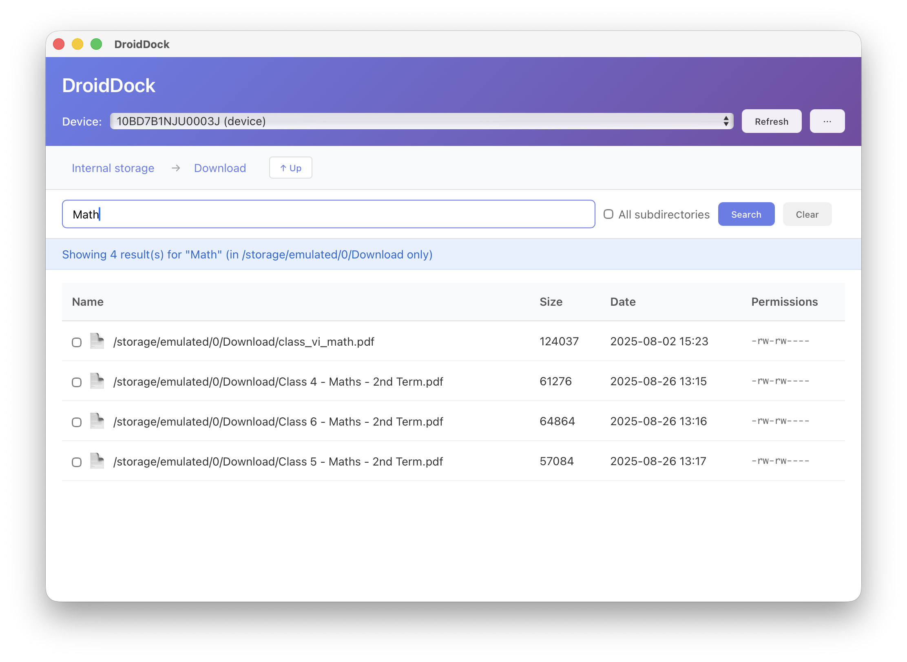

# DroidDock

A sleek macOS desktop application for browsing Android device files via ADB (Android Debug Bridge).

## Features

- **📱 Device Detection**: Automatically detects connected Android devices
- **📂 File Browsing**: Navigate through your Android device's file system with an intuitive interface
- **🔍 File Search**: Search for files by name with case-insensitive matching and recursive search
- **🗑️ File Deletion**: Delete files and folders with confirmation dialogs and safety checks
- **📥 File Download**: Download files from device to Mac with save dialog
- **📤 File Upload**: Upload files from Mac to device with file picker
- **✅ Multi-Select**: Select multiple files with checkboxes, Ctrl/Cmd+click, and Shift+click range selection
- **🖼️ Thumbnails**: Automatic thumbnail generation for images and videos with lazy loading
- **🏠 Smart Breadcrumbs**: Clean navigation with "Internal storage" labels and arrow separators
- **👁️ Hidden Files Toggle**: Show or hide dot files with a single click
- **📊 File Information**: View file permissions, sizes, and modification dates
- **💾 Storage Info**: Real-time storage usage display in VSCode-style status bar
- **⌨️ Keyboard Shortcuts**: Delete (delete files), Ctrl+F (search), Ctrl+A (select all), Escape (clear)
- **🎨 Dark Mode Support**: Automatically adapts to your system theme
- **🛠️ Smart ADB Detection**: Automatically finds ADB in common installation locations
- **⚙️ Custom ADB Path**: Set a custom ADB path if it's not automatically detected

## Screenshots



*DroidDock showing file search functionality with results displayed in a clean, intuitive interface*

## Prerequisites

Before running DroidDock, you need to have:

### 1. ADB (Android Debug Bridge)

**Install via Homebrew (Recommended)**:
```bash
brew install android-platform-tools
```

**Or download manually**:
- Download from: [Android Platform Tools](https://developer.android.com/tools/releases/platform-tools)

DroidDock automatically checks these common ADB locations:
- `/opt/homebrew/bin/adb` (Apple Silicon Homebrew)
- `/usr/local/bin/adb` (Intel Mac Homebrew)
- `/opt/local/bin/adb` (MacPorts)
- `~/Library/Android/sdk/platform-tools/adb` (Android Studio)

### 2. Node.js (for development)

- **Version**: 20.19+ or 22.12+
- Download from: https://nodejs.org/

### 3. Rust (for development)

- Install from: https://rustup.rs/

## Installation

### Option 1: Download Release (Coming Soon)

Download the latest `.dmg` file from the [Releases](https://github.com/rajiv/droiddock/releases) page.

### Option 2: Build from Source

1. Clone the repository:
   ```bash
   git clone https://github.com/rajiv/droiddock.git
   cd droiddock
   ```

2. Install dependencies:
   ```bash
   npm install
   ```

3. Run in development mode:
   ```bash
   npm run tauri dev
   ```

4. Or build for production:
   ```bash
   npm run tauri build
   ```

   The compiled app will be in `src-tauri/target/release/bundle/`.

## Usage

### 1. Connect Your Android Device

Enable USB debugging on your Android device:
1. Go to **Settings** → **About Phone**
2. Tap **Build Number** 7 times to enable Developer Options
3. Go to **Settings** → **Developer Options**
4. Enable **USB Debugging**
5. Connect your device via USB

### 2. Verify ADB Connection

```bash
adb devices
```

You should see your device listed.

### 3. Launch DroidDock

- The app will automatically detect your device
- Select it from the dropdown menu
- Browse files starting from `/storage/emulated/0` (main storage)

### 4. Navigate & Manage Files

- **Single-click** folder names to open them
- Use **breadcrumb navigation** or the **↑ Up** button to go back
- Toggle **Show Hidden Files** in settings to view dot files
- Toggle **Show Thumbnails** in settings to enable/disable image and video previews
- Click **Refresh** to reload the device list

### 5. Search for Files

- Type in the **search bar** to find files by name (case-insensitive)
- Check **All subdirectories** to search recursively through all folders
- Click **Search** or press Enter to execute the search
- Search results show full file paths
- Click **Clear** to exit search mode

### 6. Select & Delete Files

- **Click checkbox** or **click row** to select files
- **Ctrl/Cmd + Click**: Toggle individual files for multi-select
- **Shift + Click**: Select a range of files between two clicks
- **Ctrl/Cmd + A**: Select all visible files
- Press **Delete** or **Backspace** key to delete selected files
- Confirm deletion in the dialog that appears
- The app prevents deletion of critical system directories

## Tech Stack

- **Frontend**: React + TypeScript + Vite
- **Backend**: Rust + Tauri
- **Styling**: Custom CSS with dark mode support

## Project Structure

```
droiddock/
├── src/                 # React frontend
│   ├── App.tsx         # Main application component
│   ├── App.css         # Styles
│   └── main.tsx        # Entry point
├── src-tauri/          # Rust backend
│   ├── src/
│   │   ├── lib.rs      # ADB commands and core logic
│   │   └── main.rs     # Application entry point
│   ├── Cargo.toml      # Rust dependencies
│   └── tauri.conf.json # Tauri configuration
└── package.json        # Node.js dependencies
```

## Available ADB Commands

The app implements these Tauri commands:

- `check_adb()` - Verify ADB installation
- `get_devices()` - List all connected devices
- `list_files(device_id, path)` - List files in a directory
- `delete_file(device_id, file_path, is_directory)` - Delete files and folders with safety checks
- `search_files(device_id, search_path, pattern, recursive)` - Search for files by name
- `get_thumbnail(device_id, file_path, extension, file_size)` - Generate thumbnails for images and videos
- `detect_storage_path(device_id)` - Automatically detect the primary storage path
- `get_storage_info(device_id, path)` - Get storage usage statistics for device
- `download_file(device_id, device_path, local_path)` - Download file from device to Mac
- `upload_file(device_id, local_path, device_path)` - Upload file from Mac to device
- `set_adb_path(path)` - Set custom ADB path
- `get_current_adb_path()` - Get current ADB path

## Keyboard Shortcuts

DroidDock supports these keyboard shortcuts for faster navigation and file management:

| Shortcut | Action |
|----------|--------|
| `Ctrl/Cmd + F` | Focus search bar |
| `Ctrl/Cmd + A` | Select all visible files |
| `Delete` or `Backspace` | Delete selected files (shows confirmation dialog) |
| `Escape` | Clear selection or exit search mode |
| `Enter` (in search bar) | Execute search |

## Troubleshooting

### ADB Not Found

If the app can't find ADB:

1. **Install ADB** via Homebrew:
   ```bash
   brew install android-platform-tools
   ```

2. **Or set a custom path**:
   - The app will show a setup screen
   - Enter the full path to your ADB executable (e.g., `/opt/homebrew/bin/adb`)
   - Click "Set Path"

### Device Not Showing Up

- Ensure USB debugging is enabled on your device
- Check if device is recognized: `adb devices`
- Try clicking the "Refresh" button in the app
- You may need to accept the debugging authorization prompt on your device

### Permission Errors When Browsing

- Some system directories require root access
- Try browsing user-accessible directories like `/storage/emulated/0` or `/sdcard`

### Can't Navigate Into Folders

- **Single-click** on the folder name (the blue text) to open it
- Wait for the loading indicator to finish
- Note: Clicking elsewhere on the row selects the folder instead of opening it

## Development

### Run Development Server

```bash
npm run tauri dev
```

Changes to React files will hot-reload automatically. Changes to Rust files will trigger recompilation.

### Build Production App

```bash
npm run tauri build
```

### Run Tests

```bash
# Frontend tests
npm test

# Rust tests
cd src-tauri && cargo test
```

## Future Enhancements

Potential features for future releases:

- 📷 **File Preview** - Preview images and text files in-app
- 💾 **Drag & Drop** - Drag files to/from the app
- 📱 **Multiple Devices** - View multiple devices simultaneously
- ⏱️ **File Sync** - Sync files between Mac and Android
- 📊 **Sortable Columns** - Sort files by name, size, date, etc.
- 📈 **Transfer Progress** - Show progress bars for file transfers
- 📁 **Folder Download/Upload** - Support for transferring entire directories

## Contributing

Contributions are welcome! Please feel free to submit a Pull Request.

1. Fork the repository
2. Create your feature branch (`git checkout -b feature/AmazingFeature`)
3. Commit your changes (`git commit -m 'Add some AmazingFeature'`)
4. Push to the branch (`git push origin feature/AmazingFeature`)
5. Open a Pull Request

## License

MIT License - see [LICENSE](LICENSE) file for details.

## Acknowledgments

- Built with [Tauri](https://tauri.app/) - A framework for building desktop applications with web technologies
- Icons from system emoji set
- Inspired by the need for a simple, native Android file browser on macOS

## Support

If you encounter any issues or have questions:
- Open an issue on [GitHub Issues](https://github.com/rajiv/droiddock/issues)
- Check the [Troubleshooting](#troubleshooting) section above

---

**Note**: DroidDock requires USB debugging to be enabled on your Android device. This app does not collect or transmit any personal data.
